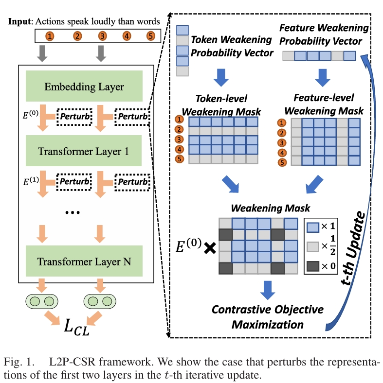

# Learning to perturb for contrastive learning of unsupervised sentence representations

## Overview

We propose ***[L2P-CSR](https://ieeexplore.ieee.org/abstract/document/10214626)***, which adopts a learnable perturbation strategy for improving contrastive learning of sentence representations.



## Train L2P-CSR

### Evaluation

Our evaluation code for sentence embeddings is following the released code of [SimCSE](https://github.com/princeton-nlp/SimCSE), it is based on a modified version of [SentEval](https://github.com/facebookresearch/SentEval). It evaluates sentence embeddings on semantic textual similarity (STS) tasks and downstream transfer tasks. For STS tasks, our evaluation takes the "all" setting, and report Spearman's correlation.

Before evaluation, please download the evaluation datasets from the official website.


### Training

**Environment**

To faithfully reproduce our results, please use the correct `1.8.1` pytorch version corresponding to your platforms/CUDA versions.

```bash
pip install torch==1.8.1+cu111 -f https://download.pytorch.org/whl/torch_stable.html
```


Then run the following script to install the remaining dependencies,

```bash
pip install -r requirements.txt
```

**Data**

We utilize the released data from SimCSE that samples 1 million sentences from English Wikipedia. You can run `data/download_wiki.sh` to download it.

**Training scripts**

We provide the training scripts for BERT/RoBERTa-base/large. You can run it to automatically finish the training on BERT/RoBERTa-base/large backbone models, and then evaluate it.
```bash
bash run_unsup_example.sh
```

For BERT/RoBERTa-base models, we provide a single-GPU (or CPU) example, and for BERT/RoBERTa-large models we give a **multiple-GPU** example. We explain some important arguments in following:
* `--model_name_or_path`: Pre-trained checkpoints to start with. We support BERT-based models (`bert-base-uncased`, `bert-large-uncased`) and RoBERTa-based models (`RoBERTa-base`, `RoBERTa-large`).

For results in the paper, we use 8 * Nvidia 3090 GPUs with CUDA 11. Using different types of devices or different versions of CUDA/other softwares may lead to slightly different performance.

## Citation

Please cite our paper if you use L2P-CSR in your work:

```bibtex
@article{zhou2023learning,
  title={Learning to perturb for contrastive learning of unsupervised sentence representations},
  author={Zhou, Kun and Zhou, Yuanhang and Zhao, Wayne Xin and Wen, Ji-Rong},
  journal={IEEE/ACM Transactions on Audio, Speech, and Language Processing},
  year={2023},
  publisher={IEEE}
}
```
